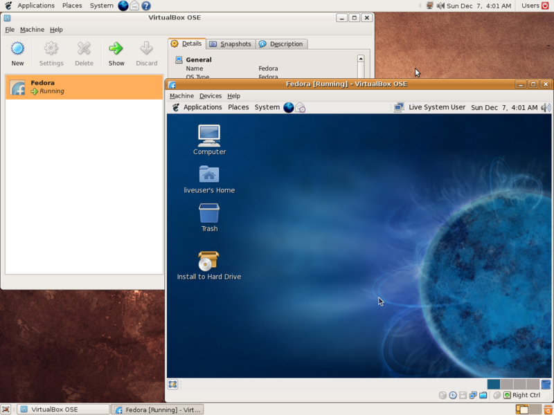

# MercadoTech
MercadoTech prueba de Intro
#Integrantes
1- Federico Villarruel :partying_face:
2- Ramiro Preuss :grinning:
3- Maribel Zamora :grinning:
4- Jorge Rodriguez :japanese_goblin:

***Maquinas Virtuales***
Es un tema muy interesante para poder entender como 
los entornos virtuales pueden ayudar a realizar
tareas en multiples plataformas distintas
sin tener que recurrir a un equipo fisico nuevo

